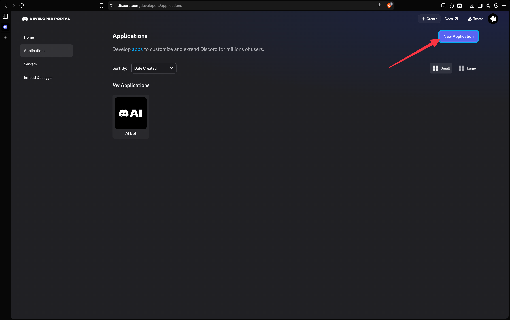
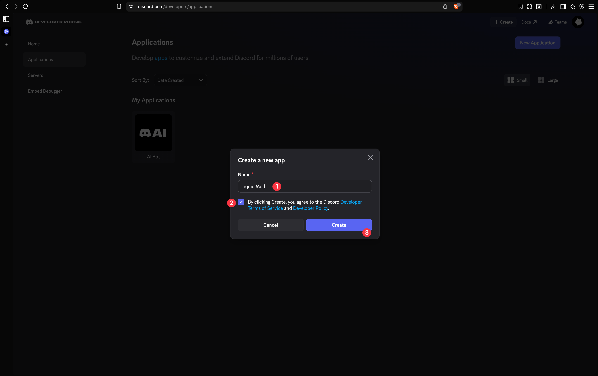
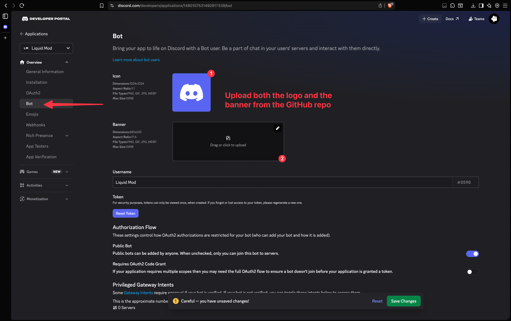
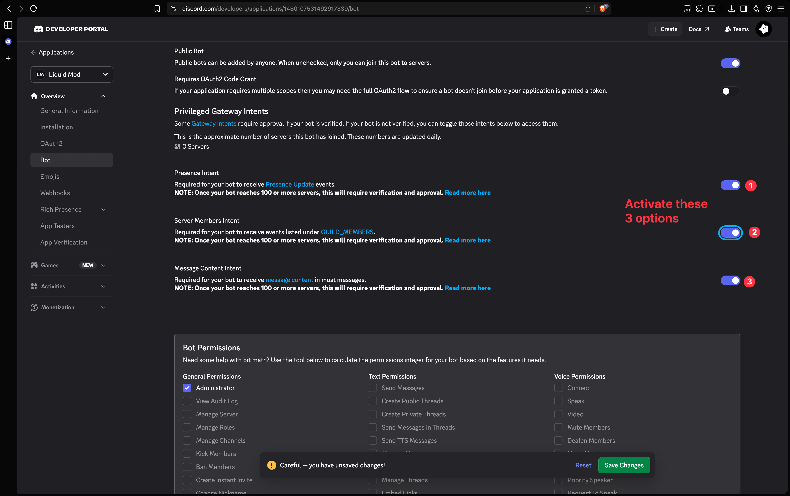
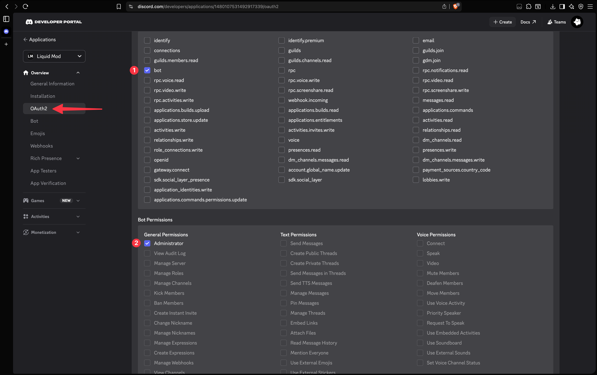
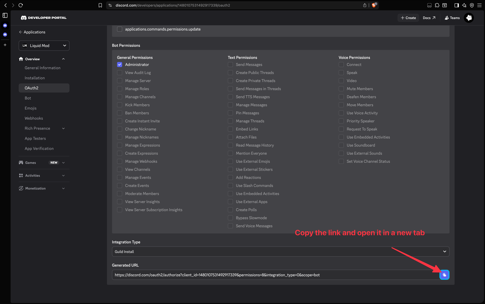
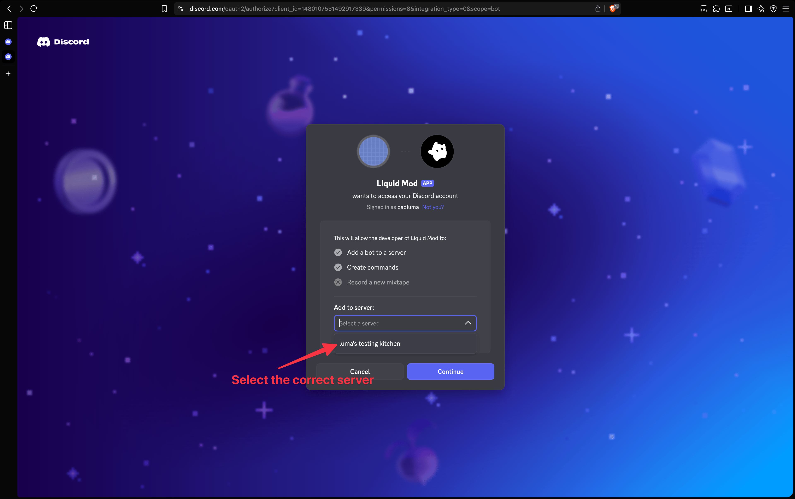
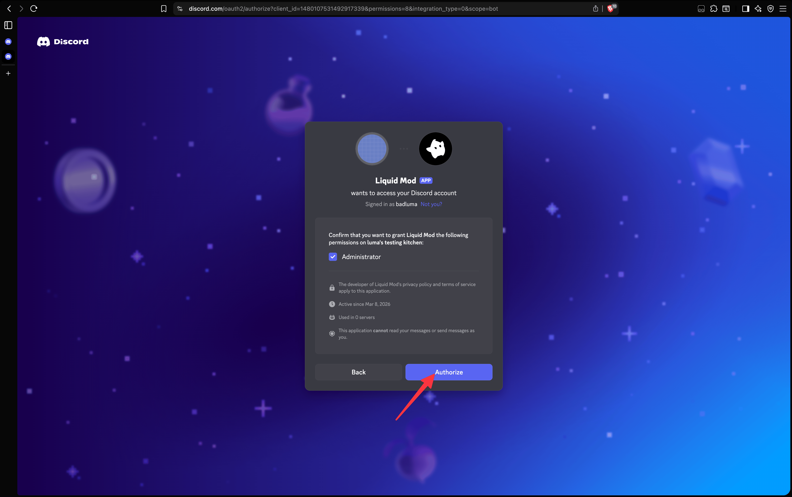
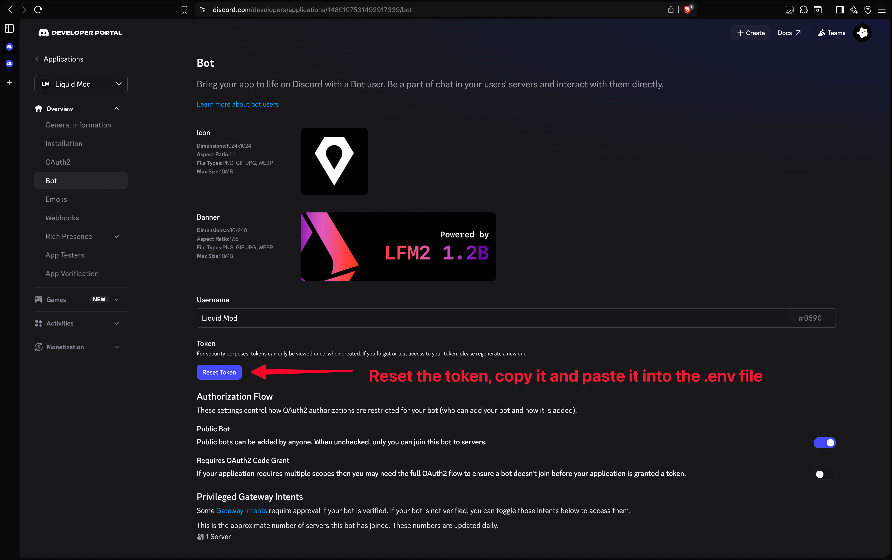

# Liquid Mod

A discord bot made to prevent scams on the Liquid AI Community Server

---

## Features

- **Keyword moderation** — automatically delete, kick, ban, or mute users based on configurable word lists
- **AI scam detection** — uses a local LLM to flag and delete likely scam messages above a character threshold
- **Debug mode** — when enabled, the bot processes all messages including those from admins and itself

---

## Prerequisites

- Python 3.11+
- [Ollama](https://ollama.com) installed and running
- A Discord bot token with the `Message Content Intent` enabled

---

## Installation

### Windows

```bat
REM 1. Clone the repository
git clone <your-repo-url>
cd <repo-folder>

REM 2. Create and activate a virtual environment
python -m venv venv
venv\Scripts\activate

REM 3. Install Python dependencies
pip install discord.py python-dotenv ollama

REM 4. Install Ollama from https://ollama.com/download, then pull the default model
ollama pull sam860/lfm2:1.2b
```

### Unix (Linux / macOS)

```bash
# 1. Clone the repository
git clone <your-repo-url>
cd <repo-folder>

# 2. Create and activate a virtual environment
python3 -m venv venv
source venv/bin/activate

# 3. Install Python dependencies
pip install discord.py python-dotenv ollama

# 4. Install Ollama (if not already installed)
curl -fsSL https://ollama.com/install.sh | sh

# 5. Pull the default model
ollama pull sam860/lfm2:1.2b
```

### Creating the bot










---

## Configuration

1. Create a `.env` file in the project root:
   ```
   BOT_TOKEN=your_discord_bot_token_here
   ```

2. Edit `config.toml` to configure moderation rules and AI settings:
   - Add words/phrases to the `delete`, `kick`, `ban`, or `mute` lists under `[moderation]`
   - Adjust `time_to_mute` (in minutes) for timed-out users
   - Set `min_chars` under `[ai]` to control the minimum message length the AI will check
   - Set `debug_mode = false` under `[debug]` when deploying to production

---

## Running the Bot

Make sure Ollama is running in the background, then start the bot:

```bash
# Ensure Ollama is running
ollama serve

# In a separate terminal, start the bot
python main.py
```